# Coins Classification

A computer vision and deep learning project that trains a **Convolutional Neural Network (CNN)** to classify Brazilian coin images, then applies **transfer learning and fine-tuning** to adapt the learned features to a smaller UK coin dataset.

The project demonstrates CNN design, image augmentation, multiclass classification, transfer learning, fine-tuning and inference using **Python, TensorFlow/Keras and Matplotlib**.

[](https://colab.research.google.com/drive/1rrLPKKt8kYj0Db9dWg1ry3el-EWh6N2t)

**[Open the complete project in Google Colab](https://colab.research.google.com/drive/1rrLPKKt8kYj0Db9dWg1ry3el-EWh6N2t)**

> **Note:** You may need to sign in to a Google account to run the notebook.
> If the notebook opens in read-only mode, select **File → Save a copy in Drive**
> to create an editable version.

---

## Project Overview

The project is split into two main stages.

### 1. Brazilian Coin Classification

A CNN is trained from scratch on a Brazilian coin dataset containing:

- **765 training images**
- **300 validation images**
- **5 coin classes**

The Brazilian dataset is used to teach the network useful visual features for recognising coins.

### 2. Transfer Learning to UK Coins

The trained Brazilian model is then adapted to a smaller UK coin dataset containing:

- **309 images**
- **8 coin classes**
- **250 training images**
- **59 validation images**

Because the UK dataset is much smaller, the project reuses features learned from the Brazilian dataset rather than training a completely new network from scratch.

---

## Tech Stack

| Technology | Purpose |
|---|---|
| Python | Project implementation |
| TensorFlow / Keras | CNN construction, training and transfer learning |
| NumPy | Numerical processing and prediction handling |
| Matplotlib | Training and results visualisation |
| ImageDataGenerator | Image preprocessing and data augmentation |
| Google Colab | Development and execution environment |
| GitHub | Version control and project documentation |

---

## Project Workflow

```mermaid
flowchart LR
    A[Brazilian Coin Images] --> B[Image Preprocessing & Augmentation]
    B --> C[Train CNN from Scratch]
    C --> D[Evaluate Brazilian Model]
    D --> E[Freeze Learned Layers]
    E --> F[Replace Output Layer]
    F --> G[Train on UK Coin Images]
    G --> H[Unfreeze Higher CNN Layers]
    H --> I[Fine-Tune Model]
    I --> J[Inference on New Coin Image]
```



---

## Dataset

### Brazilian Coins

The Brazilian dataset is organised into separate training and validation directories.

| Dataset Split | Images | Classes |
|---|---:|---:|
| Training | 765 | 5 |
| Validation | 300 | 5 |
| **Total** | **1,065** | **5** |

The images are downloaded directly within the notebook.

### UK Coins

The UK dataset contains a smaller number of examples across **8 classes**.

A validation split of **20%** is created automatically using Keras.

| Dataset Split | Images | Classes |
|---|---:|---:|
| Training | 250 | 8 |
| Validation | 59 | 8 |
| **Total** | **309** | **8** |

---

## Image Preprocessing & Augmentation

All images are resized to:

```text
100 × 100 × 3
```

Pixel values are normalised using:

```python
rescale=1./255
```

To increase variation in the training data and reduce overfitting, augmentation is applied using:

- Rotation
- Width shifting
- Height shifting
- Shearing
- Zooming
- Horizontal flipping

Example configuration:

```python
ImageDataGenerator(
    rescale=1./255,
    rotation_range=40,
    width_shift_range=0.2,
    height_shift_range=0.2,
    shear_range=0.2,
    zoom_range=0.2,
    horizontal_flip=True
)
```

---

## CNN Architecture

The Brazilian coin classifier uses a custom CNN trained from scratch.

### Convolutional Feature Extraction

```text
Input: 100 × 100 × 3
        ↓
Conv2D: 32 filters, 3×3, ReLU
        ↓
MaxPooling2D: 2×2
        ↓
Conv2D: 64 filters, 3×3, ReLU
        ↓
MaxPooling2D: 2×2
        ↓
Conv2D: 128 filters, 3×3, ReLU
        ↓
MaxPooling2D: 2×2
```

### Classification Layers

```text
Flatten
   ↓
Dense: 256 units, ReLU
   ↓
Dropout: 0.2
   ↓
Dense: 5 units, Softmax
```

The Brazilian model contains approximately **3.37 million trainable parameters**.

---

## Brazilian Model Training

The Brazilian classifier is trained for **50 epochs** using:

- **Loss:** Categorical cross-entropy
- **Optimizer:** RMSprop
- **Learning rate:** 0.001
- **Batch size:** 15
- **Metric:** Accuracy

The model reached a **best observed validation accuracy of approximately 92.7%** during training, with a validation accuracy of **90.0%** at the final epoch.

---

## Transfer Learning to UK Coins

The trained Brazilian CNN is reused to classify UK coins.

The learned layers are frozen so their existing weights are retained, and the original **5-class output layer** is replaced with a new:

```text
Dense: 8 units, Softmax
```

layer for the eight UK coin classes.

At this stage:

- Total parameters: approximately **3.37 million**
- Trainable parameters: **2,056**
- The transferred feature-extraction layers remain frozen
- Only the new UK classification layer is trained

The transfer-learning model is trained for **50 epochs** using:

- **Loss:** Categorical cross-entropy
- **Optimizer:** RMSprop
- **Learning rate:** 0.0001
- **Batch size:** 10

The first transfer-learning stage reached a **best observed validation accuracy of 52%**.

---

## Fine-Tuning

To improve adaptation to the UK dataset, the later layers of the transferred model are unfrozen starting from the third convolutional layer.

The model is then fine-tuned for a further **60 epochs** using:

- **Optimizer:** Stochastic Gradient Descent (SGD)
- **Learning rate:** 0.0001
- **Momentum:** 0.9
- **Loss:** Categorical cross-entropy

After unfreezing, approximately **3.35 million parameters** become trainable.

The fine-tuning stage reached a **best observed validation accuracy of 54%**.

The difference between the Brazilian and UK results highlights the difficulty of adapting a multiclass image classifier to a much smaller dataset with fewer examples per class.

---

## Results Summary

| Model Stage | Classes | Training Images | Validation Images | Best Observed Validation Accuracy |
|---|---:|---:|---:|---:|
| Brazilian CNN | 5 | 765 | 300 | ~92.7% |
| UK Transfer Learning | 8 | 250 | 59 | 52% |
| UK Fine-Tuning | 8 | 250 | 59 | 54% |

The project shows that the CNN performs strongly on the larger Brazilian dataset, while transfer learning provides a practical starting point for adapting the model to the much smaller UK dataset.

It also demonstrates the limitations of training a multiclass image classifier when only a small amount of labelled data is available.

---

## Inference

After training and fine-tuning, the model can be used to classify a new UK coin image.

The image is:

1. Loaded from disk
2. Resized to **100 × 100**
3. Converted to a NumPy array
4. Rescaled to the **0–1** range
5. Passed through the trained UK model

Example:

```python
img = load_img(fname, target_size=(100, 100))
x = img_to_array(img)
x = x.reshape((1,) + x.shape)
x /= 255

prediction = UKmodel.predict(x)
```

The output is an eight-element probability distribution corresponding to the eight UK coin classes.

---

## Key Skills Demonstrated

### Deep Learning

- Convolutional Neural Networks
- Multiclass image classification
- Softmax classification
- Categorical cross-entropy
- Dropout regularisation
- Model training and evaluation

### Transfer Learning

- Freezing pretrained layers
- Replacing classification layers
- Reusing learned image features
- Selective layer unfreezing
- Fine-tuning with a reduced learning rate

### Image Processing

- Image resizing
- Pixel normalisation
- Data augmentation
- Directory-based image loading

### Python & Tools

- Python
- TensorFlow
- Keras
- NumPy
- Matplotlib
- Google Colab

---

## Repository Structure

```text
coins-classification/
│
├── README.md
├── coins_classification.ipynb
└── .gitignore
```

The coin datasets do not need to be stored in the repository because they are downloaded within the notebook.

---

## Run the Project

The easiest way to view and run the complete project is in **Google Colab**:

### [Open Coins Classification in Google Colab](https://colab.research.google.com/drive/1rrLPKKt8kYj0Db9dWg1ry3el-EWh6N2t)

> **Note:** You may need to sign in to a Google account to run the notebook.
> If it opens in read-only mode, select **File → Save a copy in Drive**
> to create an editable version.

The Colab notebook contains the complete workflow:

1. Download the Brazilian coin dataset
2. Preprocess and augment the images
3. Build and train the Brazilian CNN
4. Evaluate the trained model
5. Download and prepare the UK coin dataset
6. Apply transfer learning
7. Fine-tune selected CNN layers
8. Run inference on a new coin image

The notebook can also be viewed directly on GitHub:

[View the notebook on GitHub](coins_classification.ipynb)

---

## Possible Improvements

Potential extensions to the project include:

- Increasing the size and diversity of the UK coin dataset
- Separating augmentation from the UK validation pipeline
- Adding a held-out test dataset
- Adding a confusion matrix and per-class performance metrics
- Using early stopping and model checkpointing
- Comparing the custom CNN with a pretrained image model
- Experimenting with additional fine-tuning strategies
- Saving and loading the trained model for standalone inference
